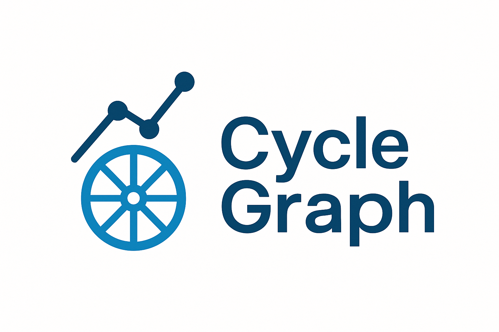

<p align="center">
  
</p>


# 🚴‍♂️ CycleGraph – Smarter Training, Better Trends

**CycleGraph** er et analyseverktøy for syklister som kobler sammen puls, watt og varighet for å si noe om hvor effektiv treningen din faktisk er – og hvordan den utvikler seg over tid.

🔁 Navnet spiller på to ting:
- **Graph** som i grafdatamodell (RDF / kunnskapsgraf)
- **Graph** som i treningsgraf – puls, watt, trender og fremgang

---

## 💡 Hva gjør det?

- 📈 Beregner **watt/puls-effektivitet** per økt
- 🧪 Validerer om økten matcher intensjon (f.eks. terskeltrening)
- 🚨 Varsler om avvik: lav effekt, høy puls, eller uvanlig mønster
- 📊 Viser trend over tid – *blir du faktisk bedre?*
- 🔁 Bruker smart caching for rask gjenbruk og spørring
- 🔌 Strava-integrasjon og webgrensesnitt kommer i neste faser

---

## 🛠️ Struktur

- `core/` – Rust-kjerne, eksponert som Python-modul via `pyo3`
- `cli/` – Python-skript for lokal analyse
- `data/` – Treningsdata i CSV eller RDF-format
- `shapes/` – SHACL-regler for treningsvalidering
- `docs/` – Logo, illustrasjoner og demoer

---

## 🔒 Om lisens og bruk

CycleGraph er delt i to:

### 🔓 Åpen kjerne
All treningsanalyse og datamodellering som ligger i `/core`, `/cli`, `/data` og `/shapes` er fritt tilgjengelig for læring og ikke-kommersiell bruk. Lisens: **CycleGraph Non-Commercial License v0.1**

### 🔒 Prototype og kommersiell del
Strava-integrasjon, API og webapp utvikles som en lukket MVP og er ikke inkludert i dette repoet. Disse delene vurderes for fremtidig kommersiell bruk.

---

## 📫 Vil du teste eller bidra?

Er du syklist og nysgjerrig på hvor effektivt du trener?  
Kontakt: jstromo83@gmail.com eller legg igjen en issue i repoet.


## 🖥️ Eksempel: Kjøring fra kommandolinjen

```bash
$ python cli/analyze.py --file data/2025-08-01.csv
🚴‍♂️ CycleGraph v0.1

⏱️ Varighet: 2t 5min
💓 Snittpuls: 158 bpm
⚡ Snittwatt: 198 W

📈 Effektivitet: 1.25 watt/puls
✅ Status: Økten matcher terskelprofilen
